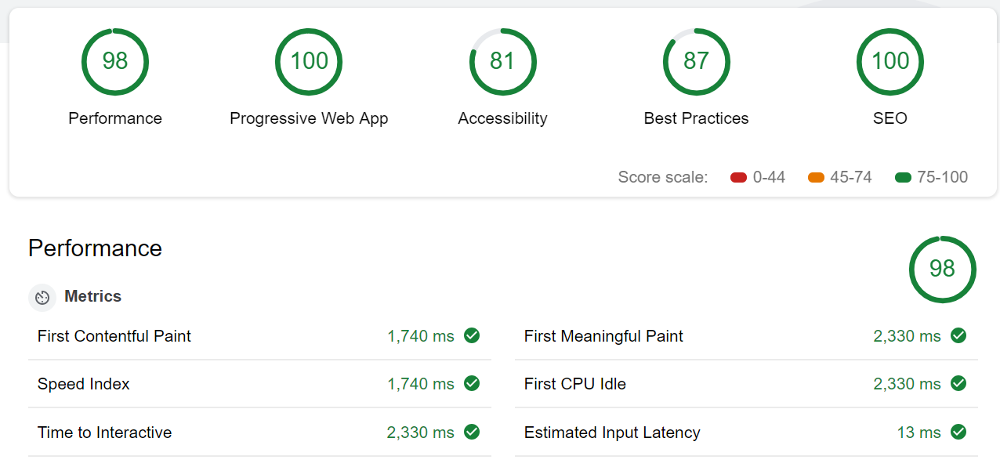

# quizair

> Node Express MongoDB Preact PWA hosted on [quizair.herokuapp.com](https://quizair.herokuapp.com/)

-   **Express** as a server
-   **MongoDB / Mongoose** to store data
-   **Preact Material Components** as layout
-   **Preact Router** for navigation
-   **Unistore** for state management
-   **Parcel Bundler** for bundling
-   **Parcel Plugin SW Cache** for Progressive Web Application support
-   **Mocha** with **Travis** integration for server tests
-   **100%** in Lighthouse Audit

    

## Change log

-   28.08.18 - Mocha tests and Travis integration
